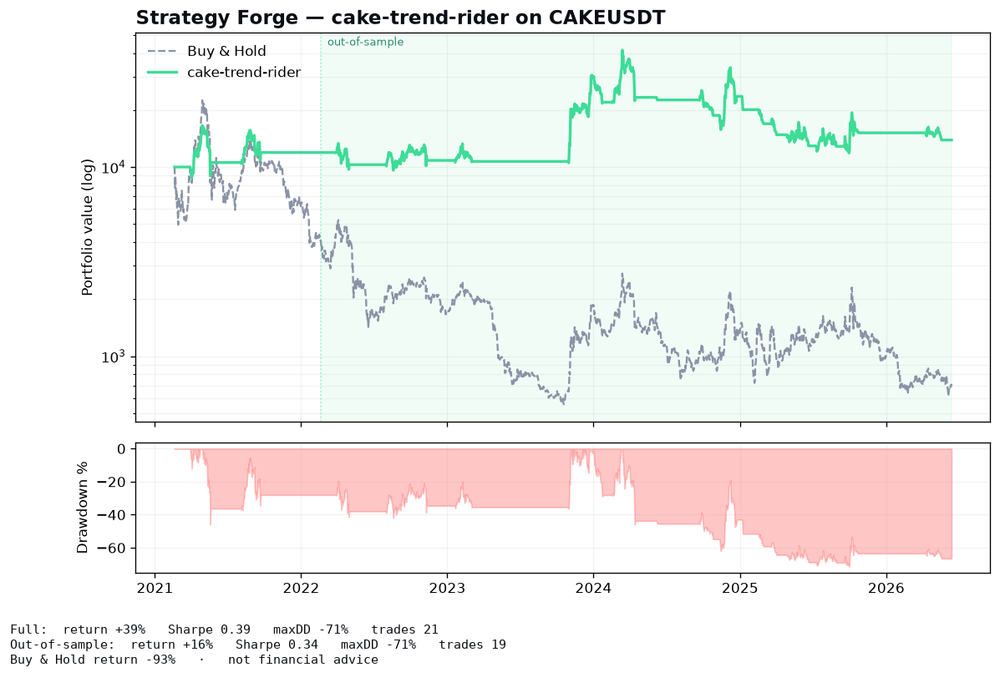
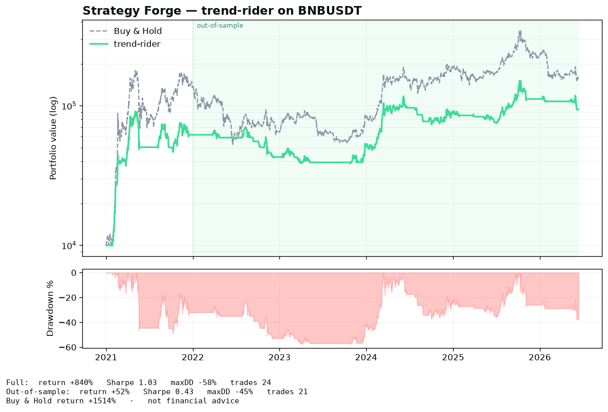

<!-- markdownlint-disable MD033 MD041 -->
<h1 align="center">⚒️ Strategy Forge</h1>

<p align="center">
  <b>Describe a crypto strategy in plain English → get a rigorous, reproducible backtest.</b><br>
  A CoinMarketCap-powered strategy-generation Skill. <i>Quantopian for crypto, authored as an LLM Skill.</i>
</p>

<p align="center">
  <i>BNB Hack: AI Trading Agent Edition — Track 2 (Strategy Skills) · zero-cost · 100% reproducible · 91 tests</i>
</p>

---

## What it is

Strategy Forge is a **CoinMarketCap Agent-Hub Skill**. You describe a trading idea; the
Skill compiles it into a structured, validated **strategy spec**, runs a real
[vectorbt](https://github.com/polakowo/vectorbt) backtest with **walk-forward
validation, transaction costs, and look-ahead-safe execution**, and returns an equity
curve, Sharpe / Sortino / Calmar / max-drawdown, and an honest out-of-sample verdict.
You don't write quant code — you describe intent and get evidence.

```text
"Build me a trend-following BNB strategy that sizes down when volatility spikes."
  → compiled StrategySpec → walk-forward backtest → tearsheet + out-of-sample stats
```

## Results that tell the real story

Every number below is **walk-forward, cost-adjusted, and reproducible with no API key**
(`make demo`). We don't cherry-pick — we show what each strategy actually does.

| Strategy | Asset | Total return | Sharpe | Max DD | Out-of-sample | Buy & Hold |
|---|---|---:|---:|---:|---:|---:|
| **trend-rider** | BNB | **+840%** | 1.03 | −58% | +52% | +1514% |
| **trend-rider** | CAKE | **+39%** | 0.39 | −71% | +16% | **−93%** 💀 |
| regime-guard | CAKE | +13% | 0.22 | −54% | +13% | −93% |
| fgi-contrarian *(baseline)* | BNB | −83% | −0.32 | −84% | — | +1514% |

**The point isn't "beat buy-and-hold on a 15× bull."** It's *risk discipline*: the same
trend-rider strategy captured most of BNB's bull at far lower drawdown — and on CAKE,
which **collapsed 93%**, it *made +39%* by exiting the downtrend. That's the difference
between a profit and near-total loss.

<p align="center">
  <br>
  <sub><b>CAKE:</b> the same strategy makes +39% while buy-and-hold rides to −93%.</sub>
</p>

<p align="center">
  <br>
  <sub><b>BNB:</b> captures the bull (+840%, Sharpe 1.03) and sits in cash through the 2022 bear.</sub>
</p>

## Why it's different

- **A strategy *generator*, not one hard-coded strategy.** Intent → spec → backtest. The
  **StrategySpec** is the keystone: human-readable, machine-runnable, and (future) a live-agent config.
- **Rigor over cherry-picking.** Walk-forward / out-of-sample splits, realistic costs,
  and a one-bar execution shift so *every* signal is look-ahead safe. Metrics are derived
  from the equity curve, so anyone can recompute them.
- **100% keyless & reproducible.** Backtests pull from public, keyless sources
  (`data-api.binance.vision` for OHLCV, `alternative.me` for Fear & Greed since 2018).
  No API key, no cost, no paywall to reproduce any number in this README.
- **CoinMarketCap where it's the differentiator.** Live signals and the demo run on the
  CMC Agent Hub (MCP + REST) — Fear & Greed, altcoin-season, derivatives, narratives.

## Quickstart

```bash
make install                                  # venv + deps + editable engine
make demo                                     # run the demo strategies, write tearsheets
make test                                     # 91 tests

# or directly:
python scripts/backtest.py --spec assets/trend-rider.json --out examples
```

No API key required. To enable CMC-branded live signals + the MCP demo, see
[`references/cmc-endpoints.md`](references/cmc-endpoints.md).

## Using it as a Skill

This repo *is* a CoinMarketCap Agent-Hub Skill ([`SKILL.md`](SKILL.md)). Install it into
Claude Code / OpenClaw:

```bash
cp -r . ~/.claude/skills/strategy-forge      # folder name must match the skill name
```

Then: *"/strategy-forge build a drawdown-safe BNB momentum strategy"* — the agent
compiles a spec, runs the backtest, and reports honest out-of-sample results.

## Architecture

```
SKILL.md ─▶ StrategySpec (JSON, the IR) ─▶ scripts/backtest.py ─▶ forge engine
                                                                   ├─ data/     keyless OHLCV + Fear&Greed (CMC optional)
                                                                   ├─ strategy/ spec schema · pure signals · HMM regime
                                                                   └─ backtest/ vectorbt + walk-forward → metrics.json + tearsheet.png
```

**97 tests, 94% line+branch coverage.**

| Layer | Coverage |
|---|---|
| `forge/data` (keyless sources + loader) | 90% |
| `forge/strategy` (spec · signals · regime) | 97% |
| `forge/backtest` (pipeline · engine · report) | 93% |
| `forge/run` + CLI | 100% |

Full design: [`docs/superpowers/specs/2026-06-14-strategy-forge-design.md`](docs/superpowers/specs/2026-06-14-strategy-forge-design.md).

## How it maps to the hackathon

| Target | How |
|---|---|
| **Track 2 placement** | A backtestable CMC Skill that *generates and validates* strategies, not one fixed rule. |
| **Best Use of Agent Hub** | Live signals + demo on CMC MCP/REST; strategy keys on CMC's differentiated data. |
| **Reproducibility requirement** | Keyless data sources → any judge re-runs every number with zero setup. |

## AI Build Log

This project was built end-to-end with Claude Code (Opus 4.8), test-first, with an
independent code-review pass after every module:

1. **Research before code.** Parallel agents surveyed the CMC Agent Hub, the LLM-Skill
   format, and state-of-the-art crypto backtesting before a line was written — choosing
   `vectorbt` + a keyless data layer over re-inventing them.
2. **TDD throughout.** Every module was written test-first (RED → GREEN); 91 tests, ~93%
   engine coverage.
3. **Adversarial code review.** A reviewer agent audited each layer; it caught real
   look-ahead-bias and out-of-sample-integrity bugs (e.g. a regime/OOS boundary
   contamination and an OOS-metric re-entry distortion) that were fixed before shipping.
4. **Evidence over ego.** The original "regime-momentum" headline *lost money* in
   backtest — so it was dropped. Trend-following + vol-targeting is the honest winner,
   and the results above are exactly what the engine produced, good and bad.

## License

MIT © 2026 Ste Tang. Third-party attributions in [`THIRD_PARTY.md`](THIRD_PARTY.md).
**Not financial advice.** Backtests are historical and do not guarantee future results.
